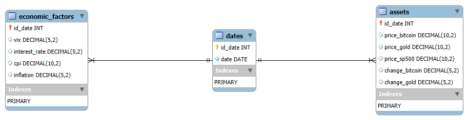

# Financial Data Management with Python & MySQL

This project demonstrates how to structure a financial dataset as a relational model, load it into MySQL with Python, pandas, and SQLAlchemy, and query the stored data with SQL. The dataset contains daily asset prices and economic indicators organized around a shared date dimension.

The main focus is relational data modeling, data ingestion, SQL, and Python/MySQL integration. The included notebook and SQL queries use the resulting database for a small set of financial analyses, but analysis is a downstream use of the data model rather than the project's primary identity.

## Data Flow

```text
CSV dataset
    ↓
Python / pandas
    ↓
SQLAlchemy / PyMySQL
    ↓
MySQL
    ↓
dates ─┬─ assets
       └─ economic_factors
    ↓
SQL queries
    ↓
Notebook analysis and visualization
```

## Data Model

### `dates`

Date dimension containing one row per dataset date:

- `id_date`: auto-incrementing integer primary key.
- `date`: the actual calendar date.

### `assets`

Asset observations keyed by `id_date`:

- `id_date`: primary key and foreign key to `dates.id_date`.
- `price_bitcoin`: Bitcoin price level.
- `price_gold`: gold price level.
- `price_sp500`: S&P 500 price level.
- `change_bitcoin`: Bitcoin change value provided by the source dataset.
- `change_gold`: gold change value provided by the source dataset.

### `economic_factors`

Economic observations keyed by `id_date`:

- `id_date`: primary key and foreign key to `dates.id_date`.
- `vix`: VIX market volatility indicator.
- `interest_rate`: interest-rate value.
- `cpi`: Consumer Price Index value.
- `inflation`: inflation value.

Both `assets` and `economic_factors` relate to `dates` through `id_date`. This separates asset observations from economic indicators while retaining a common date key for joins.



## Tech Stack

- Python
- pandas
- SQLAlchemy
- MySQL
- PyMySQL
- SQL
- Jupyter
- matplotlib

## Repository Structure

```text
.
├── README.md
├── requirements.txt
├── .env.example
├── data/
│   └── df_combined.csv
├── images/
│   ├── ERD_Workbench.png
│   └── ERD.jpg
├── notebooks/
│   └── analysis.ipynb
├── sql/
│   ├── create_database.sql
│   ├── 01_annual_asset_growth.sql
│   ├── 02_monthly_asset_statistics.sql
│   ├── 03_bitcoin_interest_rates.sql
│   ├── 04_sp500_inflation.sql
│   └── 05_bitcoin_high_volatility.sql
└── src/
    ├── __init__.py
    ├── data_pipeline.py
    └── visualization.py
```

## Setup

### 1. Clone the repository

```bash
git clone https://github.com/adrianlardies/from-data-to-insight.git
cd from-data-to-insight
```

### 2. Create a Python environment

```bash
python3 -m venv .venv
source .venv/bin/activate
pip install -r requirements.txt
```

### 3. Configure MySQL credentials

The connection helper in `src/data_pipeline.py` reads the following process environment variables:

- `MYSQL_USER`: MySQL user; defaults to `root` if unset.
- `MYSQL_PASSWORD`: MySQL password.
- `MYSQL_HOST`: MySQL host; defaults to `localhost` if unset.
- `MYSQL_PORT`: MySQL port; defaults to `3306` if unset.
- `MYSQL_DATABASE`: database name; defaults to `financial_analysis` if unset.

See [`.env.example`](.env.example) for the expected names and example values. The project does not use `python-dotenv`, so a `.env` file is not loaded automatically. Export the values into the environment from which Jupyter runs, for example:

```bash
export MYSQL_USER=root
export MYSQL_PASSWORD='your_password'
export MYSQL_HOST=localhost
export MYSQL_PORT=3306
export MYSQL_DATABASE=financial_analysis
```

Alternatively, if `MYSQL_PASSWORD` is not set, `notebooks/analysis.ipynb` requests the password interactively with `getpass`. The other connection values continue to come from environment variables or the defaults listed above.

### 4. Create the database

[`sql/create_database.sql`](sql/create_database.sql) creates the `financial_analysis` database and its `dates`, `assets`, and `economic_factors` tables, including their primary- and foreign-key relationships. Run it with a MySQL account that can create databases, for example:

```bash
mysql -u root -p < sql/create_database.sql
```

The loading workflow is designed for a new, clean database. Re-running the loader against populated tables attempts to append the same records and can violate key constraints or duplicate date rows.

## Running the Project

1. Start a local MySQL server and create the database and tables with `sql/create_database.sql`.
2. Make the required MySQL credentials available to the Jupyter process, or provide the password when the notebook prompts for it.
3. Open `notebooks/analysis.ipynb` from the repository root with Jupyter.
4. Run the notebook's ingestion cells in order. They read `data/df_combined.csv`, insert unique dates, map records to `id_date`, and append rows to `assets` and `economic_factors`.
5. Use the query files in `sql/` against the populated database. The notebook contains the corresponding analysis flow and visualizes the annual asset growth and S&P 500/inflation results.

No standalone command-line entrypoint is provided; the ingestion workflow is executed through the notebook.

## SQL Analysis

- [`01_annual_asset_growth.sql`](sql/01_annual_asset_growth.sql): selects each year's final available asset prices and calculates year-over-year percentage growth for Bitcoin, gold, and the S&P 500.
- [`02_monthly_asset_statistics.sql`](sql/02_monthly_asset_statistics.sql): calculates monthly average prices and price standard deviation for Bitcoin, gold, and the S&P 500.
- [`03_bitcoin_interest_rates.sql`](sql/03_bitcoin_interest_rates.sql): groups observations into interest-rate scenarios at or below 2% versus above 2%, then calculates Bitcoin's average price and price dispersion in each group.
- [`04_sp500_inflation.sql`](sql/04_sp500_inflation.sql): combines year-end S&P 500 growth with the average inflation value for each year.
- [`05_bitcoin_high_volatility.sql`](sql/05_bitcoin_high_volatility.sql): for rows where VIX is above 30 and inflation is above 3%, calculates Bitcoin's average price and price standard deviation together with average VIX and inflation.

Here, SQL `STD()` is applied to absolute price levels. These results describe price standard deviation or price dispersion, not return volatility. VIX is separately treated as a market volatility indicator.

## Design Decisions

- A separate `dates` dimension provides a shared key for all observations.
- Asset data and economic indicators are stored in separate relational tables connected by foreign keys.
- Python, pandas, and SQLAlchemy handle CSV ingestion and table loading into MySQL.
- SQL analysis files remain separate from the Python visualization helpers.

## Limitations

This is a portfolio demonstration built around a small included dataset of 2,293 rows and local MySQL execution. The loader assumes a new or clean database and uses append operations, so ingestion is not idempotent. The project does not implement distributed processing or a production-scale architecture. The SQL was statically reviewed during the current documentation modernization, but the workflow was not validated against a live MySQL instance. Analytically, several statistics measure dispersion in absolute price levels rather than volatility calculated from returns.

## Possible Extensions

- Add transactional, idempotent ingestion with explicit duplicate handling.
- Add automated tests for transformations, schema expectations, and SQL outputs.
- Provide a containerized local environment for reproducible MySQL and Jupyter setup.
